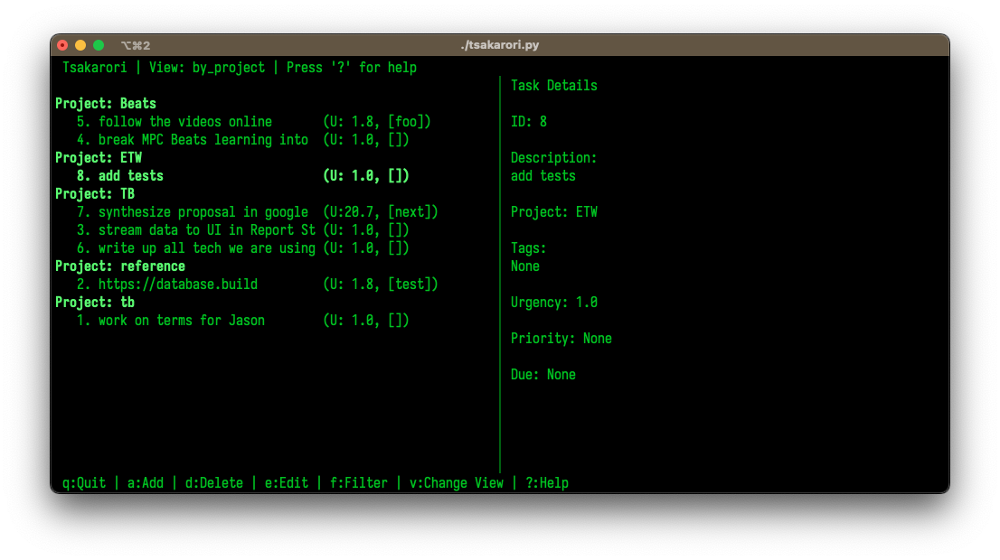

# Tsakarori - Taskwarrior Terminal Interface

 _Example interface screenshot_

A feature-rich terminal UI for [Taskwarrior](https://taskwarrior.org/) with enhanced task management capabilities and customizable interface.

## Prerequisites

**Important**: Tsakarori requires a functional [Taskwarrior](https://taskwarrior.org/) installation. Please ensure you have Taskwarrior installed and configured before proceeding.

- For Debian/Ubuntu: `sudo apt install taskwarrior`
- For macOS: `brew install task`
- For other platforms, see [Taskwarrior installation guide](https://taskwarrior.org/download/)

## Features

- **Multi-view Navigation**:
  - Task lists by urgency/project/tags
  - System statistics dashboard
  - Project/tag organization overview
- **Visual Customization**:
  - 4 built-in color schemes (default, night, day, matrix)
  - Custom color configuration support
- **Advanced Filtering**:
  - Project-based filtering
  - Tag-based filtering
  - Combined filter presets
- **Task Operations**:
  - Add/edit/complete tasks
  - Bulk tag management
  - Priority/due date management
- **Cross-platform**:
  - Works with any Taskwarrior backend
  - Compatible with standard Taskwarrior config

## Installation

### Requirements

- Python 3.8+
- Taskwarrior (task) installed and configured
- `tasklib` Python package

```bash
# First install Taskwarrior if you haven't already
# Then install the Python dependency:
pip install tasklib
```

### Install Tsakarori

```bash
git clone https://github.com/yourusername/taskwarrior-cli.git
cd taskwarrior-cli
chmod +x tsakarori.py
```

## Usage

```bash
./tsakarori.py
```

### Key Bindings

| Key | Action               |
| --- | -------------------- |
| `q` | Quit application     |
| `a` | Add new task         |
| `e` | Edit selected task   |
| `d` | Delete selected task |
| `v` | Cycle through views  |
| `p` | Filter by project    |
| `t` | Filter by tag        |
| `s` | Change color scheme  |
| `?` | Show help            |

## Configuration

Customize colors by editing `~/.config/taskwarrior-tui/config.json`:

```json
{
  "color_scheme": "matrix",
  "color_schemes": {
    "custom_scheme": {
      "header": ["black", "white"],
      "footer": ["blue", "cyan"],
      "selected": ["white", "magenta"],
      "normal": ["cyan", "black"],
      "highlight": ["yellow", "black"]
    }
  }
}
```

## Development

```bash
# Run tests
python -m unittest discover tests

# Submit PRs
1. Fork repository
2. Create feature branch
3. Submit pull request with detailed description
```

## License

MIT License - See [LICENSE](LICENSE) for details

## Related Links

- [Taskwarrior Official Website](https://taskwarrior.org/)
- [Taskwarrior Documentation](https://taskwarrior.org/docs/)
